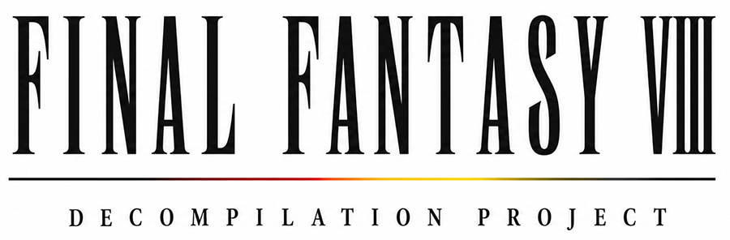

<p align="center">
  <a href="https://github.com/roengstrom/ff8-decomp">
    
  </a>
</p>

## About
This is a work-in-progress decompilation project of Final Fantasy VIII (PS1, USA — `SLUS_008.92`).

## Progress

A more detailed progress report is available on [decomp.dev](https://decomp.dev/roengstrom/ff8-decomp)

| Binary | Functions | Code |
|---|---:|---:|
| Main Executable |  |  |
| menumain.ovl |  |  |
| menucfg.ovl |  |  |
| menupty.ovl |  |  |
| menusts.ovl |  |  |
| menuabl.ovl |  |  |
| menushop.ovl |  |  |
| menuext.ovl |  |  |
| menuitem.ovl |  |  |
| menumgc.ovl |  |  |
| menugf.ovl |  |  |
| menujnc2.ovl |  |  |
| menusav.ovl |  |  |
| menucrd.ovl |  |  |
| menututo.ovl |  |  |
| menutmag.ovl |  |  |
| menutips.ovl |  |  |
| menutest.ovl |  |  |
| field_init.bin |  |  |
| intro.bin |  |  |
| field.bin |  |  |
| tripletriad.bin |  |  |
| battle_render.bin |  |  |
| battle.bin |  |  |
| world.bin |  |  |

## Contact

[Discord server](https://discord.gg/cUrPXfnh)

## Development

Any help is greatly appreciated! Below are some basic steps to get started and building the project.

1. **Clone the repo with submodules**:
   ```bash
   git clone --recursive https://github.com/rengstrom/ff8-decomp.git
   cd ff8-decomp
   ```

2. **Create a Python venv and install splat**:
   ```bash
   python3 -m venv .venv
   .venv/bin/pip install -e "tools/splat[mips]"
   ```

3. **Provide your own disc image** — You need a BIN/CUE of
   FF8 Disc 1 (USA, SLUS-00892).

4. **Extract game data from the disc**:
   ```bash
   python3 tools/extract.py /path/to/ff8-disc1.bin
   ```
   This verifies the disc SHA1, then extracts `SLUS_008.92`, all executables and overlays.

5. **Full build**:
   ```bash
   make full
   ```
   This runs `clean`, `split` (runs splat on the executable + overlays),
   `build-assets` (converts binary assets to C source), and `verify`
   (assembles, links, and checks that each output matches the original SHA1).

   For incremental work, the individual targets are also available:
   ```bash
   make split          # re-run splat
   make build-assets   # regenerate asset C source
   make verify         # build and compare SHA1s
   ```

## References
This project stands on the shoulders of giants. A lot of work has already been put into figuring out the inner workings of FF8 which I have liberally used when starting with this project. A shoutout to the decomp community as well, this project wouldn't be possible without all the work that has been put in and the tools that have developed.

- [deling](https://github.com/myst6re/deling)
- [hyne](https://github.com/myst6re/hyne)
- [FF8UltimateEditor](https://github.com/HobbitDur/FF8UltimateEditor)
- [OpenVIII](https://github.com/MaKiPL/OpenVIII-monogame)
- [FF8 Modding Wiki](https://hobbitdur.github.io/FF8ModdingWiki/)
- [Qhimm Wiki](https://qhimm-modding.fandom.com/wiki/FF8)
- [maspsx](https://github.com/mkst/maspsx)
- [splat](https://github.com/ethteck/splat)
- [decomp.me](https://decomp.me/)

## License

This project does not contain any game assets or copyrighted material. It is a clean-room decompilation for educational and preservation purposes. You must provide your own copy of the game to build.
